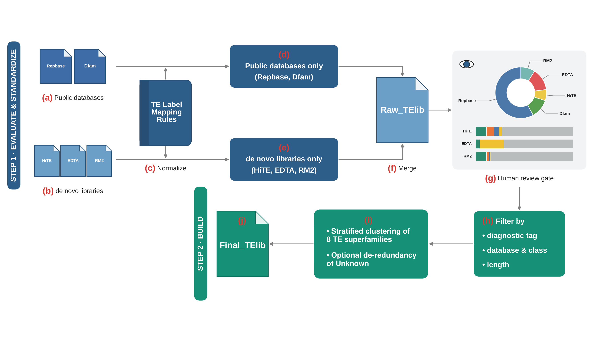

<p align="center">
  
</p>

<h1 align="center">RepLibBuilder</h1>

<p align="center">
  <b>Automated construction, evaluation, and refinement of species-specific repeat libraries.</b>
</p>

<p align="center">
  <a href="https://doi.org/10.5281/zenodo.21473020"></a>
  <a href="LICENSE"></a>
  
</p>

RepLibBuilder (RLB) is a two-step bioinformatics pipeline that rescues, standardizes,
diagnoses, and condenses transposable element (TE) libraries. It merges public databases
(**Repbase**, **Dfam**) with *de novo* predictions (**HiTE**, **EDTA**, **RepeatModeler2**),
and applies a **dual-engine diagnostic system** — TEsorter protein-domain evidence (Track A)
combined with structural heuristics (Track B) — to score every candidate sequence, repair
misclassifications, and produce a high-fidelity, non-redundant library for genome masking and
comparative/evolutionary analysis.

---

## Table of contents

- [Key features](#key-features)
- [How it works](#how-it-works)
- [Installation](#installation)
- [Quick start](#quick-start)
- [Step 1 — `evaluate`](#step-1--evaluate)
- [Step 2 — `build`](#step-2--build)
- [Diagnostic tags & scoring](#diagnostic-tags--scoring)
- [Stratified clustering & `--dedup_unknown`](#stratified-clustering--dedup_unknown)
- [Output layout](#output-layout)
- [The interactive HTML report](#the-interactive-html-report)
- [Input requirements](#input-requirements)
- [Repository layout](#repository-layout)
- [Citation](#citation)
- [License](#license)

---

## Key features

- **Universal standardization.** Chaotic raw headers from HiTE / EDTA / RM2 and public
  databases are rewritten into a single canonical `ID#Class/Superfamily` grammar via a
  customizable regex dictionary (`te_mapping_rules.tsv`).
- **Dual-engine diagnosis (Track A + Track B).** TEsorter protein-domain evidence is used to
  confirm, correct, or recover class/superfamily assignments; sequences without domains are
  handled by structural rules rather than being blindly discarded.
- **Active repair & tagging.** Every *de novo* sequence receives one of five biological
  diagnostic tags (`Confirmed`, `Corrected`, `Recovered`, `Exempted`, `Unverified`) that you
  can use to make informed filtering decisions in Step 2.
- **Interactive HTML report.** A self-contained dashboard with per-tool confidence indices,
  tag distributions, N50 / length tables, and diagnostic radar charts.
- **Memory-safe filtering.** Streaming (generator-based) filtering with O(1) dictionary
  lookups, so genome-scale libraries can be cascaded through the filters without loading
  everything into RAM.
- **Stratified CD-HIT clustering.** Sequences are binned per TE class before clustering, which
  prevents chimeric consensus formation and lets you safely apply loose "80/80/80" thresholds.
- **Optional Unknown de-duplication.** An opt-in `cd-hit-est-2d` pass removes fully-Unknown
  consensus sequences already covered by a classified consensus, raising the classified share
  at near-zero cost.

---

## How it works

<p align="center">
  
</p>

<p align="center">
  <sub>
    <b>The RepLibBuilder workflow.</b>
    <b>Step 1 &middot; <code>evaluate</code></b> — public databases <b>(a)</b> and <i>de novo</i>
    libraries <b>(b)</b> are header-normalized <b>(c)</b> through a shared TE-label mapping
    dictionary, carried as separate public <b>(d)</b> and <i>de novo</i> <b>(e)</b> tracks, then
    merged <b>(f)</b> into a raw TE library. A self-contained interactive HTML report acts as a
    human review gate <b>(g)</b>.
    <b>Step 2 &middot; <code>build</code></b> — the raw library is filtered by diagnostic tag,
    database &amp; class, and length <b>(h)</b>, then stratified-clustered across the eight TE
    superfamilies <b>(i)</b> to yield the final, non-redundant library <b>(j)</b>.
  </sub>
</p>

RepLibBuilder is driven by a single script with **one required subcommand**:

```bash
python RepLibBuilder.py evaluate  -o <out_dir> [inputs ...]      # Step 1
python RepLibBuilder.py build     -i <step1_combined_raw.fa> -o <out_dir> [options ...]   # Step 2
```

| Step | Subcommand | Purpose |
|------|------------|---------|
| 1 | `evaluate` | Extract → standardize → diagnose/score/repair → merge all inputs; emit statistics + an HTML report. |
| 2 | `build` | Filter the merged library by tag / DB+class / length, then perform stratified CD-HIT clustering to remove redundancy. |

Check the version at any time:

```bash
python RepLibBuilder.py --version      # -> RepLibBuilder v1.0.1
python RepLibBuilder.py evaluate --help
python RepLibBuilder.py build --help
```

---

## Installation

RepLibBuilder needs a Unix-like environment, Python ≥ 3.10, and two external tools
(**TEsorter** and **CD-HIT**). The provided conda environment installs everything, including
the external tools from bioconda.

```bash
# 1. Clone the repository
git clone https://github.com/Xiang-Yunpeng/RepLibBuilder.git
cd RepLibBuilder

# 2. Create and activate the conda environment (env name: RLB_env)
conda env create -f environment.yml
conda activate RLB_env

# 3. Verify
python RepLibBuilder.py --version
TEsorter --version
cd-hit -h | head -1
```

**Dependencies** (from `environment.yml`, channels `conda-forge` / `bioconda`):

| Package | Version | Role |
|---------|---------|------|
| python | ≥ 3.10 | runtime |
| biopython | ≥ 1.80 | FASTA/sequence handling |
| numpy | ≥ 2.3.3 | length statistics (N50, medians) |
| h5py | ≥ 3.14.0 | reading the Dfam `.h5` database |
| pyyaml | — | configuration parsing |
| tesorter | ≥ 1.5.1 | protein-domain diagnosis (Track A) |
| cd-hit | ≥ 4.8.1 | clustering (`cd-hit-est`, `cd-hit-est-2d`) |

> **Note.** The Dfam `famdb` toolkit is **bundled** under `modules/famdb/` and is called
> internally — you do not need to install it separately.

---

## Quick start

```bash
# Step 1: evaluate + standardize + merge everything
python RepLibBuilder.py evaluate \
  --repbase Repbase.fa \
  --dfam_db path/to/dfam_famdb_dir --tax_id 7955 \
  --hite HiTE.fa --edta EDTA.fa --rm2 RM2.fa \
  -o ./workspace/step1 \
  -t 8 -db rexdb-metazoa

# Inspect ./workspace/step1/04.report/evaluation_report.html in a browser,
# then decide which tags/classes to drop.

# Step 2: filter by diagnosis, then cluster
python RepLibBuilder.py build \
  -i ./workspace/step1/03.merge_db/step1_combined_raw.fa \
  -o ./workspace/step2 \
  --filter_db "RM2:Unknown,EDTA:Unknown" \
  -c 0.8 -aL 0.8 -aS 0.8 \
  -t 16

# Final library: ./workspace/step2/02.cluster/step2_clustered_final.fa
```

---

## Step 1 — `evaluate`

> Extract, standardize, diagnose/score/repair, and merge all input libraries.

### Arguments

**Public database inputs**

| Flag | Argument | Default | Description |
|------|----------|---------|-------------|
| `--repbase` | `FILE` | – | Path to a **raw Repbase FASTA export** (GIRI format; see [Configuring the public databases](#configuring-the-public-databases)). |
| `--dfam_db` | `DIR` | – | Path to a **Dfam FamDB directory** — the folder holding the partition `*.h5` files (root `*.0.h5` required), **not** a single file. |
| `--tax_id` | `ID` | – | NCBI Taxonomy ID. **Required whenever `--dfam_db` is used.** |

**De novo prediction inputs**

| Flag | Argument | Default | Description |
|------|----------|---------|-------------|
| `--hite` | `FILE` | – | HiTE output FASTA. |
| `--edta` | `FILE` | – | EDTA output FASTA. |
| `--rm2` | `FILE` | – | RepeatModeler2 output FASTA. |

**Configuration**

| Flag | Argument | Default | Description |
|------|----------|---------|-------------|
| `-o`, `--out_dir` | `DIR` | **required** | Base output directory. |
| `-t`, `--threads` | `INT` | `4` | Threads for TEsorter. |
| `-db`, `--te_db` | `NAME` | `rexdb-metazoa` | HMM database for TEsorter. Choices: `gydb`, `rexdb`, `rexdb-plant`, `rexdb-metazoa`, `rexdb-v3`, `rexdb-plantv3`, `rexdb-metazoav3`, `rexdb-pnas`, `rexdb-line`, `sine`. |
| `-m`, `--mapping` | `FILE` | built-in | Custom TE mapping dictionary. Leave unset unless you maintain your own dictionary. |

At least one input (public **or** de novo) must be supplied.

### What it does

1. Builds the numbered output tree (`01.public_db` … `04.report`).
2. Loads the shared TE dictionary.
3. **Repbase** (if given): cleans, normalizes, and de-duplicates.
4. **Dfam** (if given): extracts the curated lineage for `--tax_id` via the bundled `famdb`,
   converts EMBL → FASTA, and drops Unknown-class families.
5. **De novo** libraries (if any): normalize headers → run TEsorter → diagnose/score/repair
   each sequence (see [Diagnostic tags & scoring](#diagnostic-tags--scoring)).
6. Pools all standardized sequences into `03.merge_db/step1_combined_raw.fa`.
7. Generates `04.report/evaluation_report.html` and the backing JSON.

The pooled FASTA `step1_combined_raw.fa` is the input to Step 2.

---

## Step 2 — `build`

> Filter the merged library by diagnosis, then cluster to remove redundancy.

### Arguments

**Input / output**

| Flag | Argument | Default | Description |
|------|----------|---------|-------------|
| `-i`, `--input` | `FILE` | **required** | Merged raw FASTA from Step 1 (`step1_combined_raw.fa`). |
| `-o`, `--out_dir` | `DIR` | **required** | Base output directory for Step 2. |
| `-t`, `--threads` | `INT` | `8` | Threads for parallel CD-HIT clustering. |
| `-m`, `--mapping` | `FILE` | built-in | Custom TE mapping dictionary (default is built-in). |

**Filtering** (all optional; comma-separated lists)

| Flag | Grammar | Example | Description |
|------|---------|---------|-------------|
| `--filter_tag` | `Tag,Tag,...` | `Unverified,Exempted` | Drop sequences carrying any listed diagnostic tag. **Case-sensitive.** |
| `--filter_db` | `Software:Class,...` | `RM2:Unknown,EDTA:Unknown` | Drop specific classes from specific source tools. |
| `--filter_length` | `Software:Class:max|min:Value,...` | `EDTA:SINE:max:1000,RM2:DNA:min:50` | Drop sequences of a given tool+class outside a length bound (strict `>` / `<`). |

Filters are applied per record in a fixed order — **tag → DB+class → length** — and the first
match drops the sequence. Malformed items are silently ignored.

**CD-HIT clustering**

| Flag | Default | Description |
|------|---------|-------------|
| `-c` | `0.8` | Sequence-identity threshold. |
| `-aL` | `0.8` | Alignment coverage of the longer sequence. |
| `-aS` | `0.8` | Alignment coverage of the shorter sequence. |
| `--no_stratify` | off | Cluster all TE sequences in a **single** CD-HIT run instead of one run per class. Non-TE / structural sequences are held out in either mode; `-c/-aL/-aS` still apply. |
| `--dedup_unknown` | off | **Opt-in.** After clustering, drop fully-Unknown consensus that a classified consensus already covers (`cd-hit-est-2d`). |
| `--dedup_unknown_id` | `0.8` | Identity threshold for `--dedup_unknown`, applied to the shorter (Unknown) sequence. Must be within `[0.75, 1.0]`. |
| `--dedup_unknown_cov` | `0.8` | Coverage (`-aS`) on the Unknown sequence for `--dedup_unknown`. |
| `--dedup_unknown_aL` | `0.0` | Coverage (`-aL`) on the longer (classified) sequence. `0.0` = off; raise (e.g. `0.8`) for a stricter, more symmetric containment test that spares small Unknown fragments of large elements. |

> The three `--dedup_unknown_*` values are only validated/used when `--dedup_unknown` is set.

The CD-HIT word size `-n` is derived automatically from `-c` (e.g. `c=0.8 → n=5`), so you never
set it manually.

---

## Diagnostic tags & scoring

During Step 1, every *de novo* sequence is assigned **exactly one of five tags**, and each
source tool receives an aggregate **confidence index**. Use the tags to guide Step-2 filtering.

### The five tags

| Tag | Confidence | Meaning |
|-----|-----------|---------|
| 🟢 `Confirmed` | high | The tool's confident class matches TEsorter's class (superfamily reconciled where possible). |
| 🟢 `Corrected` | high | The tool's confident class **conflicts** with a confident TEsorter class → forced override to TEsorter's class/superfamily. |
| 🟢 `Recovered` | high | The tool labelled the sequence `Unknown`, but TEsorter found a real class → relabelled. |
| 🟢 `Exempted` | keep | A short (< 1000 bp) SINE or MITE with no domain — structurally valid but domain-less by nature. |
| 🟡 `Unverified` | review / keep | No domain evidence and not an exempt structural case (the default). |

> **There is no `Suspected_FP` tag.** Earlier development builds included a length-based
> "suspected false positive" review (the *> 4 kb with no domain* heuristic and an automatic DROP
> rule). It was **removed** after five-species benchmarking refuted the heuristic. Sequences that
> would have been flagged now simply fall through to `Unverified` and are retained — nothing is
> dropped or penalized automatically for length. Passing `--filter_tag Suspected_FP` in Step 2 is
> therefore a no-op.

> **Why `Unverified` matters.** TEsorter relies strictly on protein-domain evidence and is
> conservative by design, so many genuine non-autonomous or degraded TEs legitimately lack a
> domain and land in `Unverified`. Prefer retaining these (or applying gentle length-based
> filtering) over dropping them wholesale.

### Confidence-index scoring

**Track A** (a TEsorter domain was detected — class-level agreement is arbitrated at the
superfamily level, treating `Unknown` as "no information"):

| Outcome | Score |
|---------|-------|
| Class agrees; superfamilies confident **and** compatible (exact match or Dfam parent–child) | **+3** Perfect |
| Class agrees; TEsorter superfamily is Unknown (cannot refute) | **+2** Asymmetric |
| Class agrees; superfamilies confident but incompatible, **or** tool `Unknown` + TEsorter confident | **+1** Fuzzy |
| Tool `Unknown`; TEsorter found a class (missed detection) | **−1** Miss |
| Both confident but classes conflict | **−2** Conflict |

**Track B** (no domain detected — structural only, never penalized, nothing dropped):

| Outcome | Score |
|---------|-------|
| Short SINE / MITE (< 1000 bp) | **+0.5** |
| Short truncated copy of a domain-bearing class (LTR/LINE/DNA/RC/PLE) | **0** |
| Everything else | **0** |

Per-tool aggregates reported: `Absolute_Score`, `Normalized_Score` (per 100 sequences),
`Mean_Scored`, `Scored_Count`, `Total_Count`, plus the detailed per-bucket breakdown.

### Diagnostic header format

Repaired sequences carry a structured header:

```
><software>_<tag>_<seq_id>#<Class/Superfamily>
# e.g.  >EDTA_Confirmed_rnd-1_family-12#DNA/hAT
#       >HiTE_Unverified_seq7#Unknown
```

---

## Stratified clustering & `--dedup_unknown`

Pooling all sequences into a single CD-HIT run frequently produces **chimeric consensus
sequences**, where loosely structured elements are merged with unrelated classes on the basis of
short, spurious alignments. RepLibBuilder avoids this by clustering **per TE class**.

**Clustered bins (8):** `DNA`, `LTR`, `SINE`, `LINE`, `RC`, `PLE`, `RETROPOSON`, `UNKNOWN`.
In the default stratified mode each becomes its own CD-HIT run; a LINE can never merge with a
DNA transposon. Under `--no_stratify` all eight collapse into a single `ALL` bin.

**Held out from clustering (in either mode):** non-TE / structural classes are passed through
unchanged — `Satellite`, `Simple_repeat`, `Low_complexity`, `snRNA`, `tRNA`, `rRNA`, `scRNA`,
`ncRNA`, and similar. (CD-HIT-EST's coverage model is ill-suited to tandem repeats, and functional
families such as tRNA isoacceptors can legitimately exceed 80% identity.)

Because the biological superclasses are isolated **before** clustering, the loose default
thresholds (`-c 0.8 -aL 0.8 -aS 0.8`, the "80/80/80 rule") can be applied safely — collapsing
divergent copies of the same family into one representative without risking inter-class chimeras.

**`--dedup_unknown` (optional).** After clustering, a single `cd-hit-est-2d` pass compares the
`UNKNOWN` consensus against the classified consensus and drops any Unknown sequence that a
classified consensus already contains (directional containment on the Unknown side). This raises
the classified share of the final library without touching the classified set. Dropped sequences
are logged to `02.cluster/dedup/dropped_unknown.tsv`. The step is non-fatal: if it fails, the full
clustered library is retained.

---

## Output layout

### Step 1 (`evaluate`)

```
<out_dir>/
├── 01.public_db/
│   ├── Repbase/
│   │   ├── Repbase_custom.fixed.unique.fa
│   │   ├── dropped_sequences.log
│   │   └── unmatched_labels.log
│   └── Dfam/
│       └── Dfam_taxID_<tax_id>_clean.fa
├── 02.denovo_db/
│   ├── HiTE/  (HiTE_clean.fa, HiTE.cls.tsv, HiTE_repaired.fa)
│   ├── EDTA/  (EDTA_clean.fa, EDTA.cls.tsv, EDTA_repaired.fa)
│   └── RM2/   (RM2_clean.fa,  RM2.cls.tsv,  RM2_repaired.fa)
├── 03.merge_db/
│   └── step1_combined_raw.fa          # <- input to Step 2
└── 04.report/
    ├── evaluation_report.json
    ├── merge_stats.json
    └── evaluation_report.html         # open in a browser
```

### Step 2 (`build`)

```
<out_dir>/
├── 01.filter/
│   └── step2_filtered.fa
└── 02.cluster/
    ├── step2_clustered_final.fa       # <- your final, non-redundant library
    └── dedup/                         # only when --dedup_unknown is set
        ├── unknown_kept.fa
        └── dropped_unknown.tsv
```

---

## The interactive HTML report

`04.report/evaluation_report.html` is a single, self-contained page (light/dark toggle) with:

- A **legend** for the confidence-index scoring and the five diagnostic tags.
- A **global pool summary** — total pooled sequences and a source-composition donut.
- A cross-tool **tag distribution** (stacked bar of the five tags).
- Per-tool **quality profiling** — normalized / mean / absolute confidence scores, a
  Count / Median / N50 table for the major classes, and an eight-axis diagnostic radar.

> **Note.** The report loads its charting libraries (ECharts, Tailwind CSS) from a CDN, so an
> internet connection is required to render it. Copy the HTML to a machine with browser + network
> access if you generate it on an offline compute node.

---

## Input requirements

- **Repbase** (`--repbase`, optional) — the raw GIRI Repbase **FASTA export**. Not redistributed
  with this repository; you must obtain and configure it yourself (see
  [Configuring the public databases](#configuring-the-public-databases)).
- **Dfam** (`--dfam_db` + `--tax_id`, optional) — a Dfam **FamDB directory** (the folder of
  partition `.h5` files) plus your species' NCBI Taxonomy ID. Not redistributed; you configure it
  yourself (see [Configuring the public databases](#configuring-the-public-databases)).
- **De novo libraries** — the FASTA output of HiTE, EDTA, and/or RepeatModeler2 for your genome.
- **TEsorter** and **CD-HIT** must be on `PATH` (both are installed by `environment.yml`).

---

## Configuring the public databases

RepLibBuilder merges two public repeat databases — **Repbase** and **Dfam** — with your *de novo*
predictions. **Neither database is redistributed with this repository; you must obtain and
configure them yourself.** Both are optional (you may run with *de novo* libraries only), but when
you pass `--repbase` / `--dfam_db` they must be set up as described here.

### Repbase (`--repbase`)

- **What to provide.** The **raw Repbase FASTA export** — the classic GIRI format whose header
  lines carry three tab-separated fields (`Name`, `Classification`, `Species`), and whose
  classification field uses Repbase's own superfamily vocabulary (`Gypsy`, `Copia`, `hAT`,
  `Mariner/Tc1`, `EnSpm/CACTA`, `SINE2/tRNA`, …). RepLibBuilder cleans, normalizes, and
  de-duplicates it.
- **How to obtain it.** Since **12 April 2019**, Repbase is no longer freely downloadable — it
  requires a paid academic/individual subscription from GIRI
  (<https://www.girinst.org/repbase/>). Download the FASTA export from your subscription account.
  (Copies obtained before 2019 also work — the FASTA format is unchanged; the 2019 change was to
  access, not to the file format.)
- **Note.** This raw FASTA is a *different product* from the EMBL-formatted **"Repbase RepeatMasker
  Edition"** that RepeatMasker itself consumes. RepLibBuilder's `--repbase` expects the **plain
  FASTA export**, not the RepeatMasker-Edition `.embl` files.

### Dfam (`--dfam_db` + `--tax_id`)

- **What to provide.** `--dfam_db` is a **directory** (not a single file) holding a **Dfam FamDB
  partition set**. You supply your species' `--tax_id` (NCBI Taxonomy ID) and RepLibBuilder pulls
  the matching lineage from that database — but the FamDB directory itself must be configured by
  you.
- **How to obtain it.** Dfam is open access, but you must download a **FamDB format-2.x** release —
  currently **Dfam 3.9** is the newest one RepLibBuilder can read
  (<https://www.dfam.org/releases/Dfam_3.9/families/FamDB/>). Dfam permanently archives every past
  release, so Dfam 3.9 stays downloadable even though the site's default download now highlights
  Dfam 4.0. **Do not use the `/releases/current/` alias — it now serves Dfam 4.0, which this version
  cannot read (see Compatibility below).** From the Dfam 3.9 FamDB area, grab the partition files
  for your clade:
  - the **root partition `dfam39_full.0.h5` is mandatory** (it holds the taxonomy);
  - plus the leaf partition(s) `dfam39_full.N.h5` covering your taxa (N = 0..16; each Dfam release
    documents which partition number covers which clade);
  - `gunzip` the downloaded `*.h5.gz` files and put them **all in one directory** — keep only a
    single Dfam export per directory.
- **Point `--dfam_db` at that directory** (e.g. `--dfam_db /path/to/Dfam`) and pass `--tax_id`.
  RepLibBuilder calls the bundled `famdb` toolkit to extract the curated families for the ancestors
  and descendants of your taxon, converts them to FASTA, and drops Unknown-class entries.
- **Compatibility.** RepLibBuilder's bundled `famdb` reads **FamDB file-format version 2.x** — i.e.
  Dfam releases in the **3.x** series (Dfam 3.9 = FamDB format 2.0.0). This is the database
  **file-format** version, not the Dfam release number. **Dfam 4.0 (2026) is not supported**: it
  moved to the new component-based **FamDB format 3.0.0** (`dfam40.*.h5`), which requires `famdb`
  3.x — the bundled 2.0.5 refuses it with a version-mismatch error. (Supporting Dfam 4.0 would mean
  upgrading the bundled `famdb`, a major-version change — not just a different download.) A very old
  pre-partition monolithic single-file `.h5` is likewise not accepted.

> **Why Dfam is the open default.** Modern RepeatMasker (4.x, FamDB era) ships with Dfam — an
> openly licensed TE database — as the free alternative to the now-paywalled Repbase.
> RepLibBuilder likewise treats Dfam as the open database and Repbase as the optional
> subscription add-on.

---

## Repository layout

```
RepLibBuilder.py            # main CLI (evaluate / build)
environment.yml             # conda environment (RLB_env)
modules/
├── rating_module/          # Step-1 evaluation, scoring, repair, HTML report
├── build/                  # Step-2 filtering & stratified clustering
└── famdb/                  # bundled Dfam FamDB toolkit (third-party, CC0 — see modules/famdb/NOTICE)
utils/                      # shared helpers
```

---

## Citation

If you use RepLibBuilder in your work, please cite the archived software:

> Xiang, Y. (2026). *Xiang-Yunpeng/RepLibBuilder: RepLibBuilder v1.0.1*. Zenodo. https://doi.org/10.5281/zenodo.21473020

- **Cite all versions** (always resolves to the latest release): [`10.5281/zenodo.21473020`](https://doi.org/10.5281/zenodo.21473020)
- **This specific version (v1.0.0)**: [`10.5281/zenodo.21473021`](https://doi.org/10.5281/zenodo.21473021)

The accompanying manuscript is in preparation; this section will be updated with the paper citation upon publication.

---

## License

RepLibBuilder is released under the **MIT License** — see [`LICENSE`](LICENSE).

The bundled `modules/famdb/` toolkit is a third-party component from the Dfam
Consortium, released under **CC0 1.0** (public domain) — see [`modules/famdb/NOTICE`](modules/famdb/NOTICE).

---

*Maintained by Yunpeng Xiang. Bug reports and feature requests: please open a GitHub issue.*
